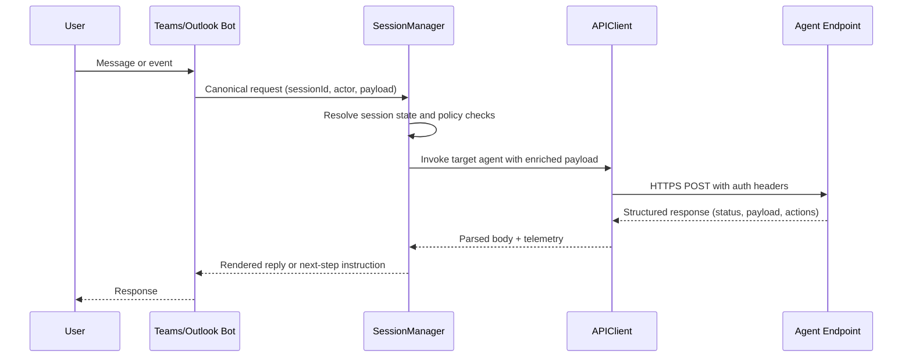

# Architecture Notes

These notes describe how the session manager, API client and agents collaborate inside the enterprise multi-agent system. The goal is to clarify runtime responsibilities, expected message shapes and the hand-offs between components so contributors can extend the platform without guessing how requests are routed.

## Core Components

- **Session Manager**
  - Maintains session state (user context, correlation IDs, replayable history) across channels such as Teams and Outlook.
  - Normalises inbound events into a canonical envelope (`sessionId`, `actor`, `intent`, `payload`, `trace`), applies access controls and selects the next agent based on orchestration rules.
  - Persists checkpoints (e.g., Dataverse or durable storage) and publishes telemetry for each hop so long-running or multi-step conversations can be resumed.
- **API Client**
  - Provides a single entry point for calling downstream agent endpoints (Logic App, Azure Function, ML endpoint, or external SaaS API).
  - Handles cross-cutting concerns: retry policy, circuit breaking, request signing (managed identity or OAuth), schema validation and consistent error envelopes.
  - Emits metrics and structured logs so the orchestrator can attribute latency or failures to the correct dependency.
- **Agents**
  - Implement bounded responsibilities (analysis, orchestration, predictions, utilities, long-running workflows, conversational UX or data movement).
  - Expose predictable interfaces (HTTP/REST or webhook triggers). Each agent declares its contract in the inventory and its deep-dive doc under `docs/agents/`.
  - Return normalized responses that include `status`, `payload`, optional `actions` (e.g., follow-up agent to call) and `observability` fields for tracing.

## Interaction Flows

### Channel-to-Agent Round Trip

### Orchestrated Multi-Agent Path
1. **Trigger** – Session manager receives an event (schedule, webhook or chat message) and resolves routing metadata.
2. **Primary call** – The API client invokes the orchestrator agent (e.g., A02). A02 determines downstream dependencies (A01, A03, A04, A07) based on policy and intent.
3. **Chained calls** – For each downstream agent, the session manager:
   - Applies idempotency keys and correlation IDs.
   - Invokes the agent via the API client and captures telemetry.
   - Interprets `actions` returned by the agent to queue subsequent calls.
4. **Aggregation** – Results are merged into the session state (Dataverse records, blob storage artifacts, or in-memory state for the current run).
5. **User notification** – The conversational agent (A06) or workflow surfaces final outputs and any approvals required.
6. **Recovery** – On error, the session manager replays from the last checkpoint, and the API client enforces retry/backoff policies.

## Extension Guide

### Add a New Agent
1. **Define the contract**
   - Add an entry to `docs/master_inventory.md` with a unique ID and summary.
   - Draft a deep-dive spec under `docs/agents/` describing triggers, request/response schemas, security and fallback paths.
2. **Expose an endpoint**
   - Implement the agent as an HTTP-accessible endpoint (Logic App standard connector, Azure Function, ML endpoint, or webhook).
   - Return the normalized response structure (`status`, `payload`, optional `actions`, `observability`).
3. **Register with the session manager**
   - Update routing tables or configuration so the session manager can map intents to the new agent ID.
   - Configure identity (managed identity or app registration) and secrets in the API client so calls are authenticated.
4. **Test the agent**
   - Unit test the agent logic locally (e.g., `npm test`, `pytest`, or Logic App test harness) focusing on schema compliance and error handling.
   - Contract test the endpoint using `curl` or Postman with representative payloads to ensure the response envelope matches platform expectations.
   - Run an integration flow via the session manager sandbox, verifying telemetry and state checkpoints are written.

### Add a New Endpoint for an Existing Agent
1. **Motivation** – Identify the new capability (e.g., extra utility function or data source) and ensure the agent’s deep-dive spec is updated.
2. **Implement the endpoint** – Deploy the new function/Logic App/API route with proper authentication and a normalized response.
3. **Wire into routing** – Add endpoint metadata to the API client configuration and extend the session manager’s routing or action handlers.
4. **Validate** –
   - Smoke test with direct HTTP calls (200/4xx/5xx handling).
   - Run a session-level integration test to confirm the new endpoint is invoked and its telemetry appears in dashboards.
   - Update regression tests so orchestrated flows cover the new path.

## Testing Strategy Cheat Sheet
- **Unit** – Fast, local tests for agent business logic and schema validation.
- **Contract** – HTTP-level validation of request/response shapes, idempotency keys, and auth headers.
- **Integration** – End-to-end runs through the session manager, verifying chained calls, state persistence and user-facing outputs.
- **Observability checks** – Confirm logs, metrics and traces are emitted with correlation IDs so runbooks can diagnose issues quickly.
