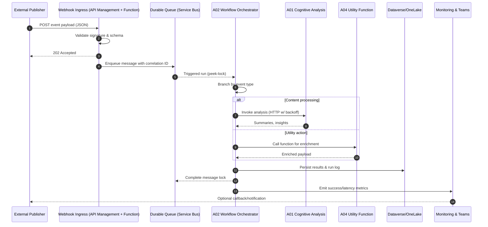
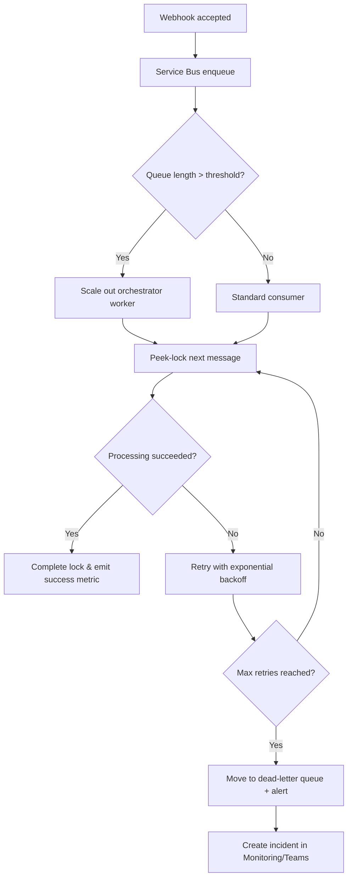
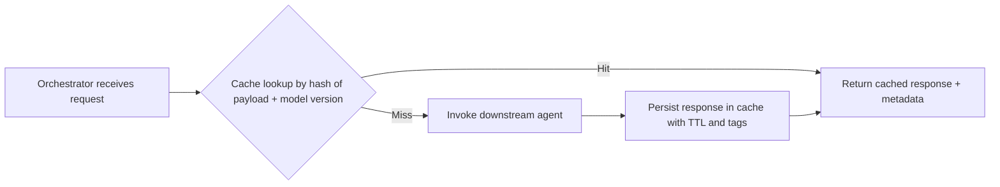
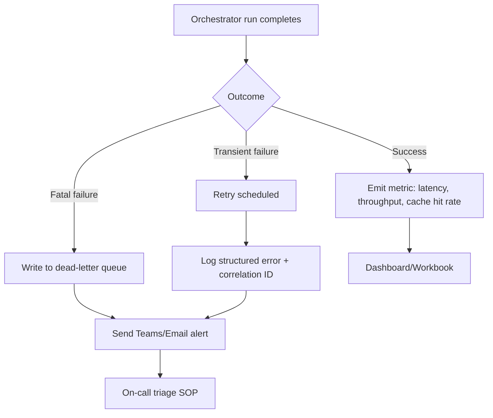

# System Interaction Flows

This document visualizes the runtime pathways that connect external entry points to the agents defined in this repository.  Use these diagrams to align implementation details (connectors, identities, retries, and observability) with the agent specifications.

## Webhook to Agent Execution (Sequence Diagram)

### Notes
- API Management or an Azure Function implements request validation (signatures, replay protection) and normalizes headers before writing to Service Bus.
- The orchestrator runs under a managed identity to pull from the queue and call downstream agents.
- Results are stored in Dataverse/OneLake with correlation IDs for tracing back to the original webhook call.

## Request Queue and Backoff Path (Flowchart)

### Notes
- Exponential backoff parameters align with connector defaults (e.g., 4 retries, max 15 minutes delay) and should mirror the orchestrator’s configuration.
- Dead-letter messages must keep the original payload, correlation ID, and last error for deterministic replay.

## Caching Path for Reused Inputs

### Notes
- Use Azure Cache for Redis or a Dataverse table keyed by payload hash and model version to avoid serving stale responses when models change.
- Cache entries store provenance (agent version, timestamp, correlation ID) to support audits.

## Alerting and Observability Signals

### Notes
- Alerts should include tenant/environment, agent ID, correlation ID, and last error to make triage actionable.
- Dashboards aggregate queue depth, cache hit rate, success/failure counts, and latency percentiles per agent.
- Use Azure Monitor action groups to route alerts to Teams channels and incident systems.
